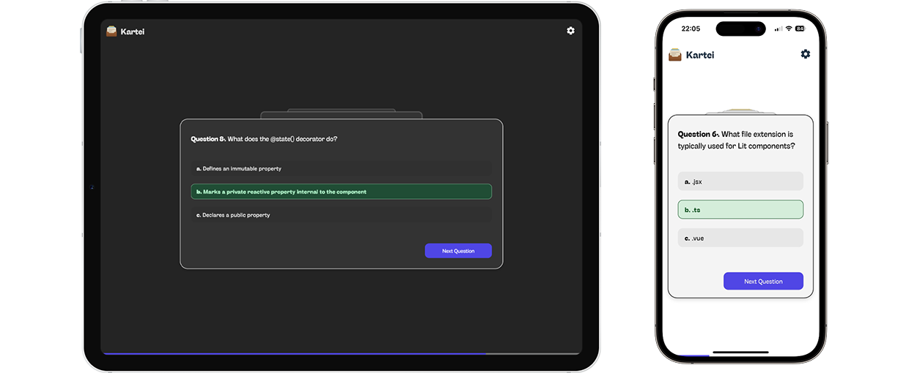

# kartei-lit

A simple flashcard app built with the Lit framework.

🔗 **[Live Demo](https://kartei.shayan.studio/)**  

## Getting Started

```bash
npm install
npm run dev
```

## Features

📚 Single-question view with multiple choices

✅ Instant feedback after answering (correct/wrong highlighting)

⏭️ Skip questions with "Postpone" option (postponed cards shown at the end)

➡️ Animated 3D transitions between stacked cards

📊 Progress bar and circular results chart

📋 Answer summary with expandable solution view

⚙️ Settings modal with Dark mode toggle (auto-detect + user preference via localStorage)

📱 Installable as PWA



## Tech Stack

- Lit
- TypeScript
- Vite
